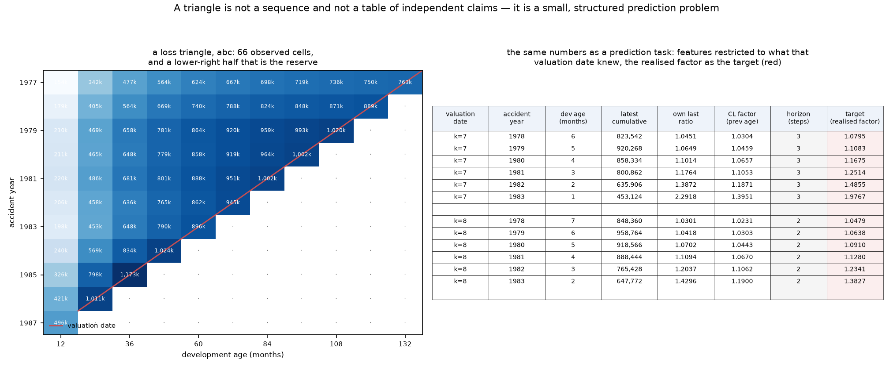
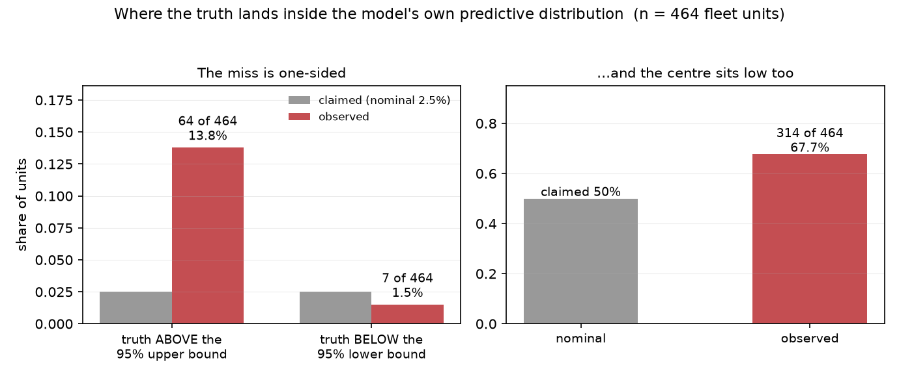
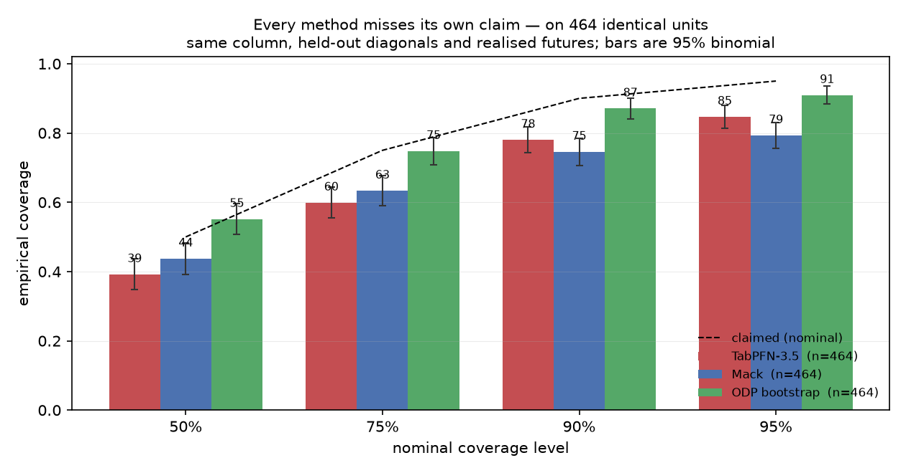
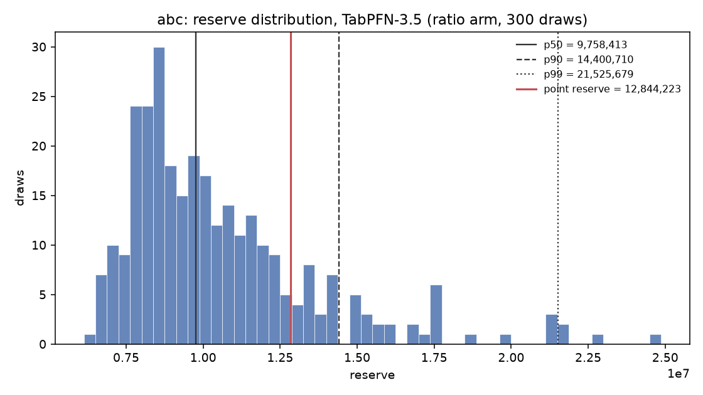

# tabpfn-reserving

**Loss reserving as a prediction problem: a reserve with its full predictive distribution, from a single
forward pass.**

Built with **[TabPFN-3.5](https://priorlabs.ai/technical-reports/tabpfn-3-5)** for the Prior Labs
[TabPFN-3.5 Hackathon](https://platform.priorlabs.ai/hackathon-3.5) — *Formalize a new problem* / *Showcase a
harness*.

> **Status: working, and the honest result is now the interesting one.** The package runs end to end on CPU;
> the reserve distribution is drawn from the model's own bar distribution and its arithmetic reproduces the
> CAS package's Chain Ladder to the pound. The point estimate still over-reserves against Chain Ladder — and
> *why* is measured rather than guessed: the model is **unbiased where it has training examples and biased
> +3.2% per step where it extrapolates**, compounding to ×1.33 over the nine steps production asks for
> ([`results/runs/20260918-023600_depth-bias/FINDINGS.md`](results/runs/20260918-023600_depth-bias/FINDINGS.md)).
> The bars were pre-registered in [`docs/method.md`](docs/method.md) before any of these numbers existed, and
> live status is in [`docs/readiness.md`](docs/readiness.md).

## Five minutes, if that is all you have

1. **[Did it work?](#did-it-work)** — the result, stated once, with what it does and does not mean.
2. **`results/figures/tail_asymmetry.png`** — where the truth lands inside the model's own predictive distribution: the miss is one-sided.
3. **`results/figures/three_method_coverage.png`** — the same measurement for Mack's method and the ODP bootstrap on identical units: **none of the three covers**, and at 90/95 Mack's is the worst.
4. **One command** — `python -m tabpfn_reserving abc --distribution` prints a reserve, its distribution and its quantiles beside Mack's and the bootstrap's, and writes its own run record.
5. **The two documents a reviewer needs**: [`docs/submission.md`](docs/submission.md) (the third-party description) and [`results/prior-art/FINDINGS.md`](results/prior-art/FINDINGS.md) (**what is new here, and what is attributed**).

## In plain terms

An insurer collects premiums now and pays claims later, sometimes years later. It has to hold money aside
against claims that have happened but are not yet settled — the **reserve** — and for a large insurer that is
billions. The future being unknown, the number is an estimate, and *how wrong it can be* matters as much as the
estimate itself: the capital a company must hold is a percentile of that range, not a single figure.

The raw material is a **loss triangle**: a table of how much has been paid for each year's claims as those
years develop. The bottom-right corner of that table hasn't happened yet. Filling it in *is* the reserve, and
since the 1930s it has been filled in with one specific piece of arithmetic — average how much each year
develops, project it forward — with the range around it bolted on afterwards.

We asked a different question: what if you simply handed the table to a general-purpose prediction model
(TabPFN-3.5) and asked it to fill in the missing part, with no actuarial arithmetic at all?

**What happened.** It works, and it returns the whole range of outcomes from a single pass on a laptop — but
the central number it produces is worse than the arithmetic it replaced on 61% of 464 real triangles, and its
range is too optimistic. So this is not a tool to use, and it does not claim to be. What it *is* — and why it
is worth ten minutes — is a **measured answer to a question nobody had answered**: where does this class of
model stop being trustworthy, and what hides that from you? The answer is in [What the model gets
wrong](#what-the-model-gets-wrong-measured) below, and one part of it — a validation window that quietly makes
the problem invisible — applies to any model of this kind, not just this one.

**If you are not a modeller**, the two things worth taking away are that the honest result of this entry is a
failure, and that the failure is *characterised* rather than merely reported: we can say exactly where the model
is reliable, where it drifts, and why a reasonable person running the obvious test would have concluded the
opposite.

## The idea

A loss triangle is the actuarial object that nobody treats as tabular. Accident periods down the side,
development periods across the top, and a lower half that is unknown: that unknown region *is* the reserve.
In current practice it is not a modelling problem at all — it is arithmetic on selected development factors,
with uncertainty bolted on afterwards by an analytical formula (Mack) or by simulation (the ODP bootstrap).

Reframed as a prediction problem, each cell of the lower triangle is a supervised target, with features
restricted to what a valuation date would actually have known. The reserve is the sum of the predictions,
and TabPFN-3.5 returns **the whole predictive distribution in the same forward pass** — `output_type="full"`,
no extra inference cost. The standard practice it is compared against obtains the same distribution from a
thousand simulated refits.

**And that is not a speed argument, because it is not a speed win.** Measured: the bootstrap's thousand refits
cost **0.38 s** per triangle, Mack **0.13 s**, and the model's forward pass **~13.4 s** — the classical methods
are roughly 25–35× *faster*, because each refit is Chain Ladder arithmetic on a 10×10 table. What the model
offers is convenience and fewer assumptions — no simulation scheme to design, no process distribution to
assume, CPU, no API calls — not throughput. A pre-registered bar in `docs/method.md` asked for the speed win
and is recorded as **falsified**.



Left: the domain object — 66 observed cells and a lower-right half that is the reserve, with the valuation
date marked in red. Right: the same numbers as a prediction task, one row per (valuation date, accident year)
pair, every feature restricted to what that valuation date knew, and the realised development factor as the
target. Two valuation dates are shown because the **horizon** — the only feature that says how far the
prediction reaches — varies *across* valuation dates and not within one, which is why the direct arm trains
across anchors rather than on a single triangle. Regenerate with `python scripts/make_figures.py`.

That is the claim this repository sets out to measure rather than assert.

## What it shows

| # | Beat | What it demonstrates |
|---|---|---|
| 1 | **The reframing** | The same numbers twice: as a shaded triangle, then as a table of cells. A domain object, turned into a prediction task, in twenty lines |
| 2 | **The reserve, zero-shot** | TabPFN-3.5 against Chain Ladder on the same triangle — no tuning and nothing fitted per triangle. *Not* "no feature engineering": the features are domain ratios chosen by hand (the link ratio, the last observed ratio, Chain Ladder's own implied factor handed in as a prior to correct), and the vendor's column-typing guidance is **not** followed — which is now an arm of its own ([#22](https://github.com/IFoA-ADSWP/tabpfn-reserving/issues/22)) |
| 3 | **The distribution** | The reserve as a distribution, drawn from the model's own bar distribution, with Chain Ladder's point estimate and Mack's standard error reported beside it in the same run. A percentile-by-percentile comparison against Mack and the ODP bootstrap is **not** built: [#20](https://github.com/IFoA-ADSWP/tabpfn-reserving/issues/20) |
| 4 | **Coverage** | Do the intervals contain the truth as often as they claim — measured for **all three methods** (this one, Mack, the ODP bootstrap) on the identical 464 real triangles. **None of them do**, and at the levels a risk margin is read Mack's is the worst of the three |
| 5 | **Scale** | 464 real triangles reserved in one unattended run (the fleet evaluation). Per-triangle wall-clock is deliberately **not** quoted — every timing taken so far is contaminated by other work on the same machine ([#9](https://github.com/IFoA-ADSWP/tabpfn-reserving/issues/9)) |
| 6 | **Where it does not win** | The triangles and cells where Chain Ladder is closer, stated in the open |

## What the model gets wrong, measured

A recursive forecast asks the model for the next step, feeds its own answer back, and asks again — nine times
over for the youngest accident year. So the per-step behaviour is where the error lives, and it can be measured
directly: `scripts/depth_bias.py` records `log(predicted ratio / actual ratio)` for every step of every
projection, against how deep into the projection that step sits. 287 scored steps across two triangles:

| depth | 0 | 1 | 2 | 3 | 4 | 5 |
|---|---|---|---|---|---|---|
| mean log error | +0.010 | +0.021 | +0.050 | +0.098 | +0.137 | +0.188 |

**Unbiased where it has training examples; +3.2% per step (se 0.36%) where it extrapolates.** The intercept is
+0.0001 — which is what makes the measurement credible — and the slope compounds to ×1.33 over nine steps.

The same diagnostic produced the trap worth more than the number: anchored at the last three valuation dates,
projections are at most two steps long, the deepest measurable depth is 2, and the slope reads **−0.0018
(se 0.0030)** — flat, and the hypothesis looks dead. Anchored from nine years back, the same triangle gives
**+0.0190 (se 0.0016)**. A backtest anchored near the ultimate cannot see the depths production uses, and it
reports a flat line while doing so. Full write-up:
[`results/runs/20260918-023600_depth-bias/FINDINGS.md`](results/runs/20260918-023600_depth-bias/FINDINGS.md).

## What we measured

Every row here is a real result stored in `results/`, reproducible with the commands in this repository.
The point estimate is not competitive and the table says so rather than leading with the parts that flatter.

| measurement | result |
|---|---|
| **Chain Ladder arithmetic** vs the CAS package's own | exact — ratio 1.000 on `abc`, `genins`, `ukmotor`, and per column on a two-column sample. Pinned by tests, because every comparison depends on it |
| **The reserve distribution**, drawn from the model's own bar distribution | the earlier 15-level grid clamped the tail: the `abc` p99 was understated by 62% (21.5m → 34.9m) |
| **Point estimate, one triangle** (`abc`, delta arm, direct) | −1.2% against Chain Ladder, where the recursive arm was **+66.8%** |
| **Point estimate, the fleet** — 464 paired evaluations over 639 triangles | closer than Chain Ladder on **38.8%**; median \|error\| 162.6% against the incumbent's 121.3%; it moves the reserve by a median of 142% of Chain Ladder's and is wrong more often than right |
| **Coverage** — do the intervals contain the truth as often as they claim? | **No, at every level**: 39.2% at 50, 59.9% at 75, 78.0% at 90, 84.7% at 95 (z between −4.8 and −6.6, n=464). The intervals are wide (the 90% one is 4.55× the point estimate) and the actual sits above the median in 67.7% of cases, so it is a centring failure rather than a width failure — `results/fleet/COVERAGE.md` |
| **Where the model fails, and why** | per-step bias is zero where the model has training rows and **+3.2% per step** (se 0.36%) where it extrapolates — `results/runs/20260918-023600_depth-bias/FINDINGS.md` |
| **Determinism** | the same command twice gives the same reserve to the pound; the point estimate is seed-independent; the draw noise floor is ~1.6% on the median at 300 draws |
| **Tests** | 47, in seconds, with no token and no model fit required |

The honest summary: **the distribution is the deliverable; the point estimate is not.** That was a
pre-registered possible outcome, and `results/fleet/FINDINGS.md` is where it is documented at fleet scale.

## Did it work?

**No.** The point estimate is not competitive and the distribution is not calibrated, and both are measured at
fleet scale rather than asserted:

- **The point estimate loses.** Closer than Chain Ladder on **38.8%** of 464 paired fleet evaluations, with a
  median error of 162.6% against the incumbent's 121.3%, losing at every horizon, while moving the reserve by a
  median of 142% of Chain Ladder's. It is not hedging toward the standard method — it overrides it and loses.
  → [`results/fleet/FINDINGS.md`](results/fleet/FINDINGS.md)
- **The distribution is miscalibrated, and one-sidedly so.** Coverage 39.2% / 59.9% / 78.0% / 84.7% against
  nominal 50 / 75 / 90 / 95 (z between −4.8 and −6.6), with intervals that are *wide* (the 90% one is 4.55× the
  point estimate). The miss is not spread across both tails: over all 464 units **13.8%** of truths sit above the
  model's own 95% upper bound against a claimed 2.5%, while only **1.5%** fall below it — and the truth exceeds the
  sampled median in **67.7%** of cases. A failed upper tail and a low centre, not general sloppiness.
  → [`results/fleet/COVERAGE.md`](results/fleet/COVERAGE.md)



Left: how often the truth falls outside each 95% bound, claimed against observed. Right: where it sits relative to
the median. Every number on this figure is computed from the 464 recorded units by `scripts/make_figures.py` rather
than typed in, so it cannot drift from the record.

**And it is not just this model.** The comparison the entry previously could not make has now been run: **Mack's
method and the ODP bootstrap, on the identical 464 units**, same column, same held-out diagonals, same realised
futures, so the three are one paired comparison rather than three runs.



| nominal | TabPFN-3.5 | Mack | ODP bootstrap |
|---|---|---|---|
| 50% | 39.2% (−4.6 SE) | 43.8% (−2.7 SE) | 55.2% (+2.2 SE) |
| 75% | 59.9% (−7.5) | 63.4% (−5.8) | 74.8% (−0.1) |
| **90%** | 78.0% (−8.6) | **74.6% (−11.1)** | 87.1% (−2.1) |
| **95%** | 84.7% (−10.2) | **79.3% (−15.5)** | 90.9% (−4.0) |

**Every method misses its own claim, and at the levels a risk margin is actually read — 90% and 95% — Mack's is
the worst of the three, worse than the model whose miscalibration motivated the experiment.** The failures are
shared rather than distinctive: at 95%, of the 71 units the model misses, Mack also misses 37 — and each covers
many units the other does not. A model whose interval failures were its own would miss where the standard method
is right; this one misses in the same weather. Full record, including the paired discordance and the width
comparison: [`results/runs/20260919-three-method-coverage/FINDINGS.md`](results/runs/20260919-three-method-coverage/FINDINGS.md).

**What did work,** and is why this is a result rather than a shrug: the reframing runs end to end; the
distribution is drawn from the model's own bar distribution with the arithmetic underneath reproducing the CAS
package **to the pound**; the pipeline is deterministic (the same command twice gives the same reserve, and the
point estimate does not depend on the seed); and the mechanism behind the failure is measured, not guessed.

**Why it failed, as best we can tell — a hypothesis, not a measurement.** Each fit sees **6–33 training rows,
median 25** — recounted from the fleet's own records (`results/conditions/rows_per_fit.log`), and no unit ever
saw more than 33. *(This corrects an earlier claim of "40–60 rows per fit", which came from single-triangle
runs.)* That is too few to learn development patterns, so the model falls back on its prior, and where that
prior pushes it off Chain Ladder it is wrong more often than right. That is consistent with everything measured:
it is unbiased where it has training examples and drifts by +3.2% per step where it extrapolates. The
experiment that would test the explanation directly is giving it more examples —
[#10](https://github.com/IFoA-ADSWP/tabpfn-reserving/issues/10).

**And that explanation is ours, not the vendor's.** Checked against Prior Labs' own technical report and
documentation (`results/conditions/FINDINGS.md`): they state **no** training-row floor, they do **not** exclude
extrapolation, and their small-data claim is explicitly about *i.i.d.* data — their non-i.i.d. evidence base
starts at 100 rows and declares sub-100-row prediction out of scope, so our regime is **unreached** by their
evidence base rather than excluded by it. What their documentation *does* predict is the split: on temporal and
grouped data, tuned conventional models retain the highest performance and TabPFN-3.5 only matches them.

**What this does *not* mean.** It is **not** evidence that the model is worse than standard practice — and that
is now measured rather than assumed: on the identical 464 units, at 90% and 95% **Mack's intervals are the worse
of the two** (74.6% and 79.3% against 78.0% and 84.7%). And it is not evidence that foundation models cannot help
with reserving: it is evidence about *this* approach, in *this* small-n regime, with the failure mode
characterised well enough to know what would have to change.

## Why a triangle is a different problem from claims modelling

Prior work on tabular foundation models in insurance has mostly tested flat, claim-level regression at scale
— hundreds of thousands of rows, heavily zero-inflated outcomes — where models of this class do not win
(see the IFoA ADSWP evidence base linked below). A triangle is not that object: a 10×10 triangle has ~55
observed cells and a 20×20 has ~210, with no zero mass in the cumulative figures. This project is a
deliberate test of the small, structured, sequential end of the problem space, and it reports the result
either way.

## Data and comparison

Both sides are public and maintained, so the comparison has authority:

- **Triangles** — the [CAS Loss Reserve Database](https://www.casact.org/publications-research/research/research-resources)
  (Meyers/Shi, from NAIC Schedule P) and the classic sample triangles. These ship **inside the
  `chainladder` package** (the `clrd` set alone is 775 triangles), so nothing is downloaded and nothing is
  vendored: the package version is pinned, and every run records a **fingerprint of the matrices it
  actually used** in its manifest, so a dataset change cannot silently invalidate a stored result.
- **Baseline** — [`chainladder`](https://github.com/casact/chainladder-python), the Casualty Actuarial
  Society's own Python package: Chain Ladder, Mack's method and the ODP bootstrap.

## Quickstart

The package installs from this repository and runs on CPU. The first run downloads the TabPFN-3.5 weights
once and needs a Prior Labs token in `TABPFN_TOKEN` (`results/spike/FINDINGS.md` has the two-minute version
and the hosted alternative).

```bash
git clone https://github.com/IFoA-ADSWP/tabpfn-reserving
cd tabpfn-reserving
python -m venv .venv && . .venv/bin/activate
pip install -e .
export TABPFN_TOKEN=...               # your Prior Labs token

# The reserve as of the latest diagonal, with its distribution, from one triangle
python -m tabpfn_reserving abc --distribution

# The same, writing the figure and the machine-readable run record
python -m tabpfn_reserving abc --distribution \
    --figure results/figures/abc_reserve_distribution.png \
    --json   results/runs/abc-reserve.json

# Scored against what actually developed afterwards, one row per anchor
python -m tabpfn_reserving abc --backtest
```

Real output from the first of those, unedited — including the part that does not flatter the method:

```
abc: 11x11  anchor = last diagonal (age 132)  55 observed transitions
  reserve (compounded point)     12,844,223   fit 4.4s  predict 39.2s
  reserve (chain-ladder)          5,277,760   like-for-like, on the same cells
  reserve (CAS package)           5,277,760   reference: includes a tail nobody can score
  reserve (sampled mean)         11,909,189   -7.3% vs the point
  reserve (sampled median)        9,671,798   -24.7% vs the point
  distribution             p5=7,452,235  p50=9,671,798  p95=20,049,586  p99=34,882,828
  distribution route          exact quantiles, bar-bins draws, 300 of them
```

Three summaries of "the reserve" are printed because they are not equal, and the gap between them is the
compounding rather than a rounding error — the point figure compounds per-cell predictions, the others
accumulate sampled paths. Which is which is stated rather than implied.

The figure it writes is the one below; `results/runs/abc-reserve.md` says what the numbers mean and
`docs/readiness.md` says what is still missing.

**Prefer a notebook?** [`notebooks/quickstart.ipynb`](notebooks/quickstart.ipynb) does the same thing end to
end — the triangle, the CAS agreement, the reserve distribution, the figure — **with its outputs stored**, so
it can be read without running anything, and it runs in Colab. A notebook committed with empty outputs is code
that claims to work; this one was executed before it landed, and re-executing it reproduces the same numbers.



Current state, honestly: [`docs/readiness.md`](docs/readiness.md).

## Reproducibility

Every figure quoted in this README is produced by a command in it and stored in `results/`. No number is
quoted that the repository cannot regenerate from public data, which is what the hackathon terms require.

## Licence

Apache-2.0 — see [LICENSE](LICENSE).

## Acknowledgements

Developed in the [IFoA Actuarial Data Science Working Party](https://www.actuaries.org.uk/) (ADSWP), whose
open evidence base on tabular foundation models in insurance —
[`IFoA-ADSWP/tabular-foundation-model`](https://github.com/IFoA-ADSWP/tabular-foundation-model) — supplies
the decision rules and the prior-negative results this project tests against. This repository is a separate,
self-contained artefact and does not redistribute that work.

TabPFN is developed by [Prior Labs](https://priorlabs.ai). This is an independent entry to their hackathon.
